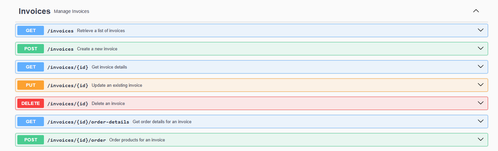

# Karaoke System API

## Table of Contents
- [Getting Started](#getting-started)
- [Authentication](#authentication)
- [API Endpoints](#api-endpoints)
  - [Auth](#auth)
  - [Bookings](#bookings)
  - [Customers](#customers)
  - [Invoices](#invoices)
  - [Permissions](#permissions)
  - [Products](#products)
  - [Roles](#roles)
  - [Rooms](#rooms)
  - [Songs](#songs)
  - [Staffs](#staffs)

## Getting Started
# This is the API documentation for the **Karaoke System**, which manages users, rooms, products, and permissions, invoices, roles, bookings for karaoke businesses.
### Requirements
- PHP >= 8.0
- Laravel >= 11.x
- MySQL (Docker)

### Installation
1. Clone the repository:
   ```bash
   git clone https://github.com/yourusername/karaoke-system-api.git

2. Install dependencies:
   ```bash
   composer install
3. Configure environment variables:
   ```bash
   cp .env.example .env
   ```
   Update .env with your database credentials and other environment-specific settings.
4. Run docker:
   ```bash
   docker compose up -d
   ```
5. Run migrations:
   ```bash
   php artisan migrate
6. Run the server:
   ```bash
   php artisan serve

## Authentication
The API uses JWT (JSON Web Token) for authentication. To access most of the endpoints, you must include the JWT token in the request headers:
   ```bash
   Authorization: Bearer <token>
   ```
Tokens can be retrieved from authentication endpoints.

## API Endpoints
### Auth
Handles user authentication, including login, registration, and token management. The endpoint allows users to authenticate and obtain JWT tokens for accessing protected resources in the API.


### Bookings
Manages room reservations and bookings in the karaoke system. It allows users to create, update, and manage their room bookings.


### Customers
Manages customer information such as personal details, contact information, and booking history. This endpoint can be used to store and retrieve customer data.


### Invoices
Handles the creation, management, and tracking of invoices for bookings or product purchases. This endpoint allows for managing billing and payment status.


### Permissions
Manages access control in the system by defining specific permissions. It is used to grant or revoke abilities for roles, determining what actions users with certain roles can perform.


### Products
Manages the inventory of products (e.g., food, drinks) available at the karaoke venue. This endpoint allows users to track product stock and update product details.


### Roles
Manages the different roles within the system, such as admin, manager, or staff. This endpoint defines roles and links them with specific permissions for access control.


### Rooms
Handles the management of karaoke rooms, including room availability, details, and capacity. This endpoint is used to list, create, and update karaoke rooms.


### Songs
Manages the catalog of songs available in the karaoke system. This endpoint allows users to browse and search for songs, add new songs, or update song details.


### Staffs
Manages staff members working at the karaoke venue. This endpoint allows administrators to manage staff information, assign roles, and track work schedules.

